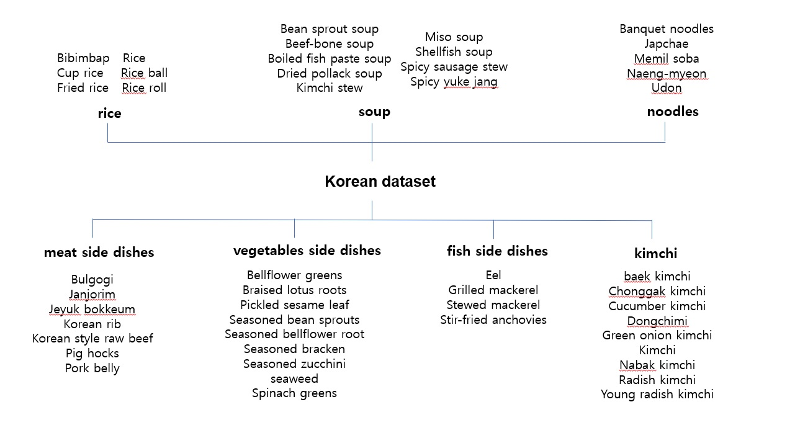

# Description of the Korean dataset  
Korean dataset has upper categories such as rice/soup/noodles/meat side dishes/vegetables side dishes/fish side dishes/kimchi  
And there are 53 subcategories, and the data have 100~150 images per category    

### [Korean food data category]
    

The 600 images were increased to 2,400 images using data augmentation. 
Data augmentation was performed using Roboflow, and optimal results were obtained when __Flip, 90 Rotate, Crop, Rotation, Shear, Saturation, Brightness, Exposure, and Blur__ were used.    
The example program using this data is as follows.  
[KoreanFood recognition using yolov5](https://github.com/heasun0111/KoreanFood_recognition_using_yolov5)
